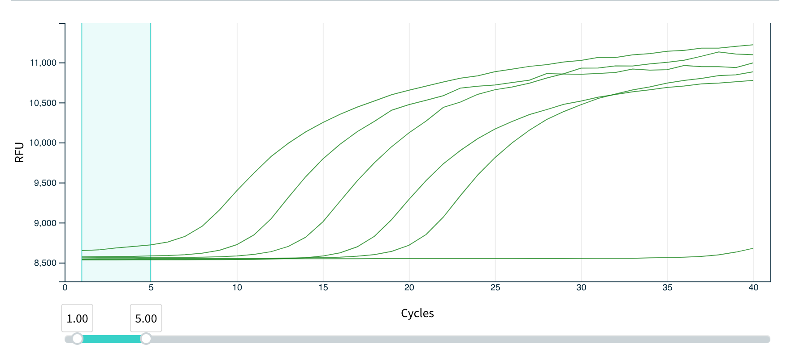
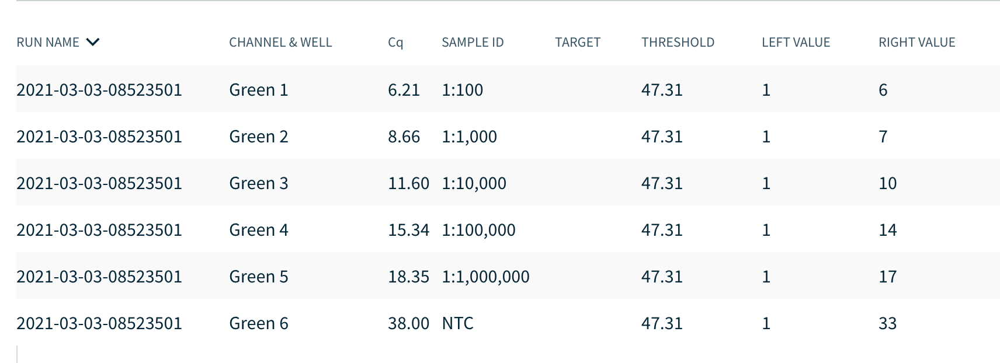

This week we talked about primer design and PCR assay. As we searched for a paper to discuss, we were trying to find one that included discussion on the actual primer design process in addition to using the primers for some sort of “interesting” application. It just so happened that Covid prompted a lot of interest in PCR assay design, so this was a good paper to help think about this process in quite a topical context. 

We also used this opportunity to design some primers and test them to amplify a portion of the Covid spike gene. It was great to learn to use the Biomeme through this process and actually test the assay live. I hoped this  might help those who have not been involved with qPCR as of yet get a little better understanding of the process by seeing it work in real time.

For a short description of the assay we did in class: we ran a SYBR assay on newly developed primers CoV-quick-FWD and CoV-quick-REV, which target a short fragment of the Spike E glycoprotein gene in COVID19. We ran a dilution series of 5 samples of template cDNA ranging from starting concentrations of 1.5 ng/ul to 0.00015 ng/ul on the handheld Biomeme. Below are resulting images showing fluorescence curves and Cq values as the Biomeme outputs. 

