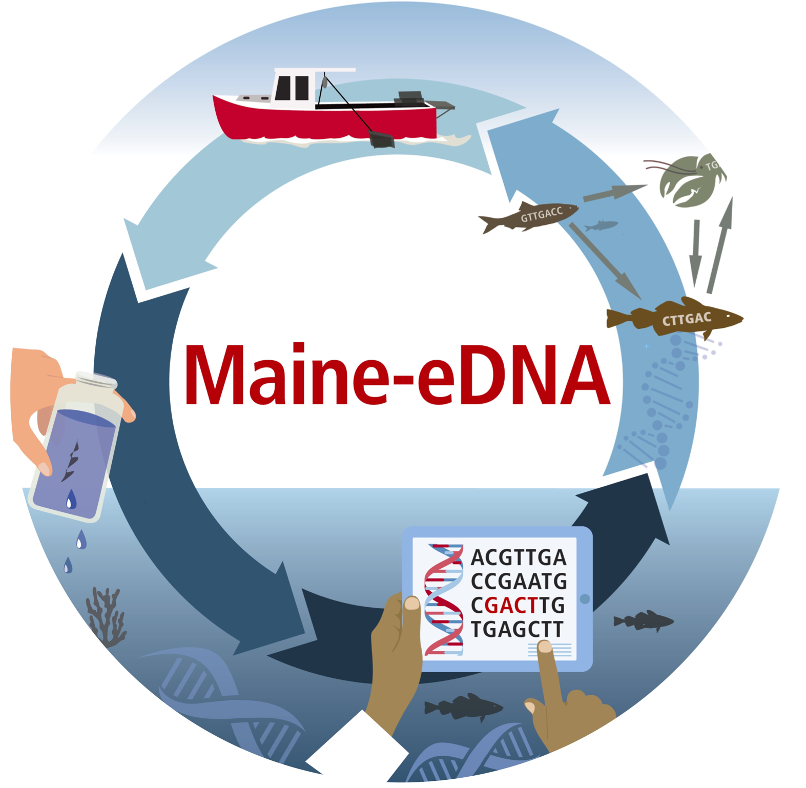

This is the course website for Fundamentals of eDNA offered Srping 2021 at the University of Maine.

## Recent Reflections

<!-- Posts -->
<ul id="posts">

	

	  <li class="post">
	  	<h3><a href="{{ post.url }}{{ post.url | prepend: site.baseurl }}">{{ post.header }}{{ post.title }}</a></h3><time datetime="{{ post.date | date_to_xmlschema }}" class="by-line"> <i>{{ post.date | date_to_string }}</i> </time>
	  	{{ post.content | strip_html | truncatewords:50 }}
	  </li>

    

</ul>

#### Head to the Reflections tab for more!
